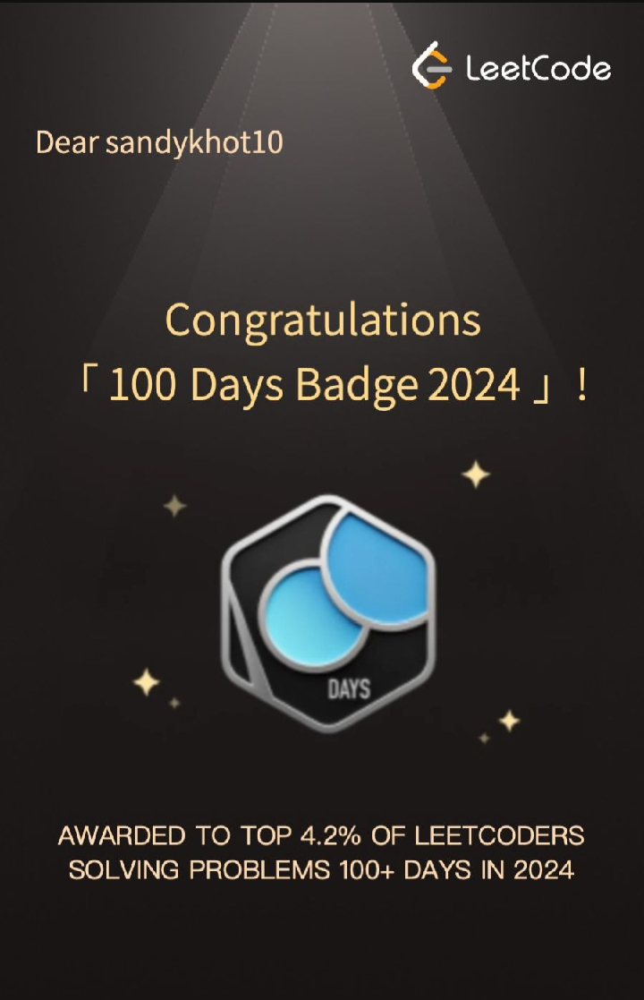
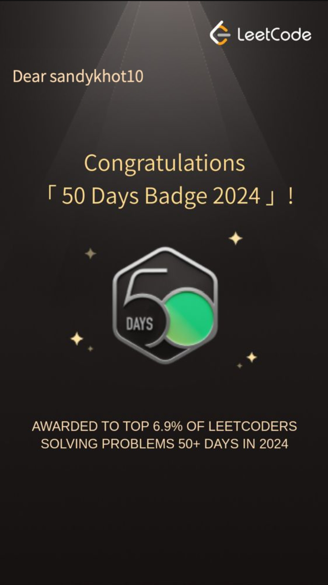
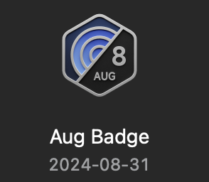
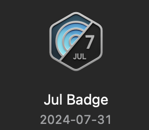
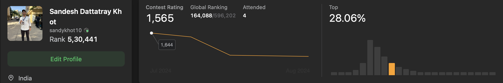

# leetcode-badges

# My LeetCode Achievements 🏆

This repository showcases my journey and achievements on [LeetCode](https://leetcode.com/), where I continually solve coding challenges to improve my problem-solving skills.

## Badges Earned 🏅

  

    
     
    👑LeetCode 100 Days of Coding Badge
    Awarded for completing 100 consecutive days of coding practice.  
  

  

    
     
    😇LeetCode 50 Days of Coding Badge**  
    Recognizes 50 days of continuous coding.
  

  

    
     
    📌LeetCode August Contest Badge
    Highlights participation in LeetCode's August contests.
  

 

    
     
    📌LeetCode July Contest Badge  
    Highlights participation in LeetCode's July contests.
  

  
  

    
     
    🥳Top 28.04% LeetCoder
    Ranked in the top 28.04% of LeetCode users.
  

## My LeetCode Profile
Feel free to check out my [LeetCode profile](https://leetcode.com/u/sandykhot10/) for more details about my coding journey!

---

### Built with ♥ by [sandy khot](https://sandeshprofile.netlify.app/)
